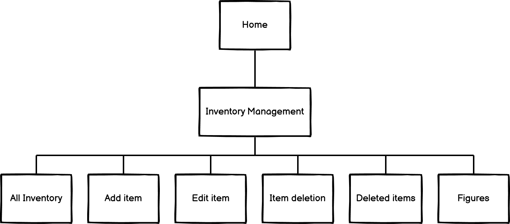

# LogiTrack web application for Shopify challenge

Visit the live Website : **[Logitrack :arrow_right:](https://XXXXXXXXX)**

## Table of Content

* [Project](#Project)
  * [Project Goals](#Project-Goals)
  * [Developer and Business Goals](#Developer-and-Business-Goals)
* [UX](#UX)
  * [Audience Definition](#Audience-Definition)
  * [User Stories](#User-Stories)
  * [Wireframes](#Wireframes)
  * [Different Design](#Different-Design)
* [Features](#Features)
* [Future features to implement](#Future-features-to-implement)
* [Database](#Database)
  * [Database Design](#Database-Design)
  * [Database Structure](#Database-Structure)
* [Technologies Used](#Technologies-Used)

## Project

### Project Goals

LogiTrack is a web application created for the Shopify internship challenge.

It is an inventory tracking web application for a logistics company that include the main CRUD operation (Create / Read / Edit / Delete).  
This app will have an extra feature that is to provide the user with the possibility to add a deletion comment and to undelete or Re-Stock option.

### Developer and Business Goals

* Develop a viable web application.
* Develop the main tools and feature for inventory tracking.
* Develop a web application with space for improvement and optimisation.

[**:back:** *Table of Content*](#Table-of-Content)

## UX

### Audience definition

* The targeted audience is a company owner or person in charge of the tracking of the inventory of a business.

### User stories

1. As an Admin, I want to add/edit/delete items.
2. As an Admin, I want to see the inventory.
3. As an Admin, I want to re-stock some previously deleted items.

[**:back:** *Table of Content*](#Table-of-Content)

#### Fonts

Considering the targeted audience, the sans serif type of font is the more appropriate because it is most often associated with simplicity and straightforwardness.  

The website will use well known and popular font that are used online in order to bring to the user a "feeling of knowing".

* *Poppins* for headings.

* *Lato* for main content.

*Sans serif* will be use as a fall back if the fonts do not load. It is common as the main typographies are sans serif type.

#### Icons

* Some Font Awesome icons will be part of the website for better UX.
* The [favicon](static/images/favicon.ico) was generated from [favicon.io](https://favicon.io/favicon-generator/).

#### Colors

The colours chosen for the website are simple and joyful.

* #F279BC
* #030BA6
* #135EF2
* #04D94F
* #F29F05

[Adobe Color](https://color.adobe.com) explore was used to find the colour scheme with the [office keyword](https://color.adobe.com/search?q=office). Compatibility and accessibility are valid and the color scheme and swatches are said color-blind safe by the accessibility tools.

#### Styling/Feeling

The feel of the website is welcoming and simple to provide a quick access and learning process.  
It makes users comfortable.

#### Audio/Video/Images

No audio, images or video will be integrated at the moment.

[**:back:** *Table of Content*](#Table-of-Content)

### Wireframes

* [Home page](documentation/wireframes/home.pdf)
* [Inventory management page](documentation/wireframes/inventory-management.pdf)
* [All inventory page](documentation/wireframes/all-inventory.pdf)
* [Add item page](documentation/wireframes/add-item.pdf)
* [Edit item page](documentation/wireframes/edit-item.pdf)
* [Delete item page](documentation/wireframes/delete-item.pdf)
* [Item deletion page](documentation/wireframes/item-deletion.pdf)
* [Deleted items page](documentation/wireframes/deleted-item.pdf)
* [Re-Stock item page](documentation/wireframes/restock-item.pdf)
* [Figures page](documentation/wireframes/figures.pdf)

For the full version:

* [LogiTrack wireframes](documentation/wireframes/logitrack.pdf)

[**:back:** *Table of Content*](#Table-of-Content)

### Different design

[**:back:** *Table of Content*](#Table-of-Content)

## Features

### Log in

### Log out

### Browse inventory

### Add item

### Edit item

### Delete item

### Re-Stock item

### Defensive design

* Extra step to confirm the deletion of a product
* When a product is deleted, it is moved from items to deleted items

[**:back:** *Table of Content*](#Table-of-Content)

## Future features to implement

[**:back:** *Table of Content*](#Table-of-Content)

## Database

### Database design

The database design used is a relational database.

* During **development**, sqlite3 was used. It is the database provided by Django and use for development.

Below is a representation of the database used for this project.  

### Database Structure

Django, the framework used for the production of this project, is an MVP: Model View Product. This means that the project build with Django is divided in multiple apps. Its structure allows separation of concern and provide many built-in features.  
The models define the data-structure.

* In this project, the following models have been developed:
  * Item
  * ItemStatus
  * Category
  * Location
  * DeletedItem
  * ContactUs
  * User (being a "default" model provided by django and allauth)

#### Models relationship

* Item :left_right_arrow: ItemStatus: **One to Many**
  * An item can be related to one item-status, and an item-status can be related to many items.

* Item :left_right_arrow: Category: **One to Many**
  * An item can be related to one category, and a category can be related to many items.

* Item :left_right_arrow: Location: **Many to One**
  * An item can be related to one location, and a location can be related to many items.

* Item :left_right_arrow: DeletedItem: **One to One**
  * An item can be related to one deleted-item, and a deleted-item can be related to one item.

* Item :left_right_arrow: User: **One to Many**
  * An item can be related to one user, and a user can be related to many items.

* DeletedItem :left_right_arrow: User: **One to Many**
  * A deleted-item can be related to one user, and a user can be related to many deleted-items.

* DeletedItem :left_right_arrow: Item: **One to One**
  * A deleted-item can be related to one item, and an item can be related to one deleted-items.

* ContactUs :left_right_arrow: User: **One to Many**
  * A message can be related to one user, and a user can be related to many messages.
  * ContactUs is basically an inbox that saves messages sent by customer. It is accessible from the inventory management page.

## Technologies Used

### Programming Languages

This project was developed using:

* HTML
* CSS
* Python
* Jinja templating language.

### Frameworks, Libraries and Programs

* [Django](https://www.djangoproject.com/)  
Framework used to develop the website.

* [Balsamiq](https://balsamiq.com/wireframes/)  
For creating wireframes.

* [Lucichart](https://www.lucidchart.com/)  
For producing the flowchart and database design.

* [Google Fonts](https://fonts.google.com/)  
For importing fonts.

* [favicon.io](https://favicon.io/favicon-generator/)  
For generating the favicon.

* [TinyPNG](https://tinypng.com/) or [Squoosh](https://squoosh.app/)  
For resizing all the images.

* [Adobe Color](https://color.adobe.com/create/image)  
For extracting the color scheme used on the website.

* [Am I Responsive?](http://ami.responsivedesign.is/?url=http://ami.responsivedesign.is/#)  
For providing screenshots of the responsiveness of the website across several devices.

* [Autoprefixer CSS online](https://autoprefixer.github.io/)  
For adding prefixer in style.css for cross browser compatibility.

* [Git](https://git-scm.com/)  
For Version control.

* [GitPod](https://www.gitpod.io/)  
For Integrated Development Environment.

* [GitHub](https://github.com/)  
For hosting the repository.

[**:back:** *Table of Content*](#Table-of-Content)

## Deployment

This project is developed on [Gitpod Workspaces IDE](https://www.gitpod.io/) (Integrated Development Environment) committed and pushed to [GitHub](https://github.com), to [my Repository](https://github.com/Tom-Nagy/logi-track-shopify-challenge) using Gitpod Command Line Interface (CLI) with [Git version control](https://git-scm.com/).

[**:back:** *Table of Content*](#Table-of-Content)
